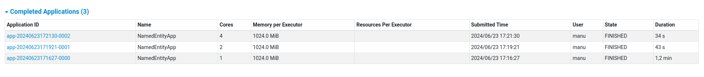
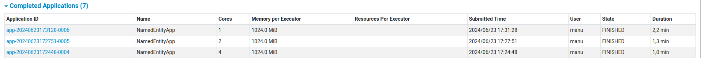

# INFORME
Informe del grupo 29 del laboratorio 3.
# Apache Maven
Para este proyecto utilizamos Apache Maven, un gestionador de proyectos basado en el concepto POM (Project Object Model), con el cual construiremos nuestro proyecto y definiremos las dependencias y recursos necesarios del mismo.
# Apache Spark
Apache Spark es uno de los mas famosos frameworks en cuanto a la big data y computacion distribuida nos referimos. 

Para trabajar con Spark necesitamos montar un cluster.
### Montar un cluster en Spark
1. Descargamos Apache Spark (Instrucciones en la consigna).
Dentro del directorio donde descomprimimos el archivo, nos cdeamos en sbin y ejecutamos "./start-master.sh", donde lanzamos una instancia del master.
2. Despues en el mismo directorio ejecutamos "./start-worker.sh spark://manu-Vivobook-ASUSLaptop-M1502YA-M1502YA:7077 *(Url que nos brinda spark en el local host 8080)* -m 1G -c 1" donde estamos instanciando un worker. 
 
    - Para poder establecer varias configuraciones de Spark trabajamos en un archivo adicional llamado "spark-env.sh" donde podemos asignarle cierta memoria x a un worker, el numero de cores, etc.
    - En "spark-env.sh" instanciamos: "SPARK_WORKER_CORES=2", "SPARK_WORKER_INSTANCES=2", "SPARK_WORKER_MEMORY=2g".

# Compilacion
Primero debemos hacer `mvn install` para crear el proyecto y `mvn clean install` para borrar la instalacion del proyecto anterior y crear un proyecto con los ultimos cambios del codigo.

Despues, para compilar, ejecutamos este template en la terminal del repositorio:

`/<route>/SPARK_FOLDER/bin/spark-submit --master <spark_url> /<route>/target/<exe>.jar <-flags> 2>/dev/null`

Donde:
* route = ruta absoluta al destino
* spark_url = Url donde se encuentra el spark con el que estamos trabajando 
* exe = nombre del ejecutable
* flags = flags del laboratorio 2 (ARGS = " ... ")
    * Respecto al laboratorio agregamos una flag mas llamada "-cd" que debe ir acompañado con una ruta de un archivo de texto. Si esta ruta es valida, lo que haya en esa ruta se computará sobre los feeds ingresados con "-f". Si es invalido, se computarán los feeds ingresados con "-f".
* 2>/dev/null = Redirigimos el output de stderr para no llegar el stdout con informacion de spark. (Para debugear es importante sacar esto ya que nos puede brindar mucha ayuda).

### Ejemplo de comando
`/home/manu/Escritorio/paradigmas/spark-3.5.1-bin-hadoop3/bin/spark-submit  --master spark://manu-Vivobook-ASUSLaptop-M1502YA-M1502YA:7077 /home/manu/Escritorio/paradigmas/pdp2024lab3g29/target/NamedEntities-0.1.jar -cd /home/manu/Escritorio/paradigmas/pdp2024lab3g29/filename.txt -f -ne CapitalizedWordHeuristic -sf -pf 2>/dev/null`

# Api de Spark para paralelizacion

# Evaluacion de desempeño sobre archivos grandes
A continuacion, vamos a mostrar los distintos desempeños de spark con distintas cantidades de workers, para asi comparar la eficiencia.

## Aclaraciones Importantes
### Comando para ejecutar 
`/home/manu/Escritorio/paradigmas/spark-3.5.1-bin-hadoop3/bin/spark-submit  --master spark://manu-Vivobook-ASUSLaptop-M1502YA-M1502YA:7077 /home/manu/Escritorio/paradigmas/pdp2024lab3g29/target/NamedEntities-0.1.jar -cd /home/manu/Descargas/wiki_dump_parcial.txt -f -ne CapitalizedWordHeuristic -sf -pf 2>/dev/null`

*CapitalizedWordHeuristic se cambia por AcronymHeuristic en el caso de usar la heuristica de acronimos.*
### Como cambiamos la cantidad de workers?
Definimos 3 variables globales en conf/spark-env.sh, las cuales son:
* SPARK_WORKER_CORES = Para setear el numero de cores a ser usados en esta maquina.
* SPARK_WORKER_MEMORY = Para setear la memoria total que le brindará un worker a los ejecutables.
* SPARK_WORKER_INSTANCES = Para setear cuantos workers tendremos trabajando al mismo tiempo.

Esta ultima variable es la que vamos a modificar para trabajar con 1, 2 o 4 workers.
## Resultados
Los resultados dependen mucho de distintos factores; los workers usados, la memoria asignada a c/u, los cores asignados a c/u, la computadora de quien ejecuta (en este caso con 16 gb de ram y ryzen 7 7700), la complejidad de la heuristica usada, etc. 

*Para esta ejecucion seteamos SPARK_WORKER_CORES = 1 y SPARK_WORKER_MEMORY = 1g.*
### Ejecucion con la heuristica "Acronym Heuristic"

Aca podemos observar un cambio notable usando 4 workers a usando uno solo. El tiempo de ejecucion es casi la mitad, algo que con archivos tan grandes, nos puede hacer notar mucho el cambio. El cambio entre 2 workers y 4, es un poco menos notable en cuanto a la comparacion de nucleos usados y tiempo de ejecucion. Ya que estamos usando 4 nucleos en vez de 2 y el tiempo mejora solo 10 segundos.
### Ejecucion con la heuristica "Capitalized Word Heuristic"

En este caso, al computar muchas mas entidades nombradas, los cambios son mayores. Al igual que antes, entre 4 workers y 1 hay una diferencia de mas de la mitad de tiempo. Pero entre 4 y 2 notamos, en este caso, 30 segundos.